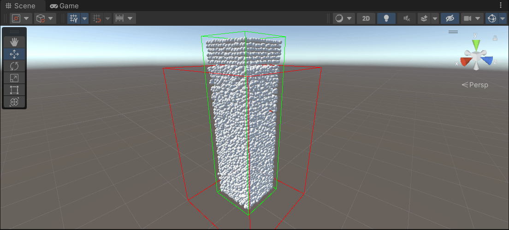
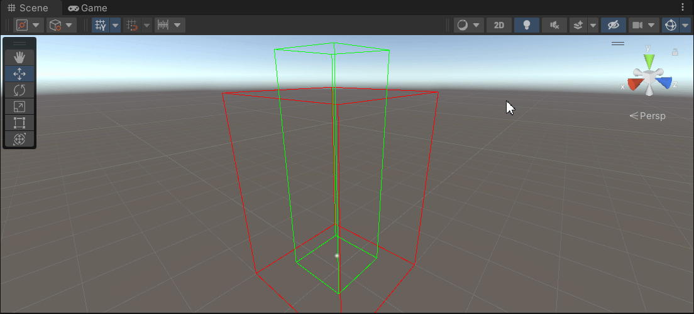

[toc]
# 0. 序言
​	在GAMES101的大作业选题中, 我选择了Position Based Fluid (基于位置的流体模拟, 保证液体密度不变).

# 1. 环境部署

​	作业使用Unity进行, 利用Unity的computer shader借助GPU同时大量的更新粒子的位置. (Unity是2021版的, 最新的Unity6对中国不开放了)

# 2. 结果

* 增加Scorr Coen系数后, 更粘稠的液体

* 稀疏的液体

# 3. 待改进的部分

​	可以看到上面的结果中, 某些粒子会飞得很高, 这种情况不知道对不对.

​	我的优化部分没做(GPU不像CPU支持复杂的指令, 可以调试, 我的调试方法是截取某些时刻的数据, 将它们打印出来:cry:)

​	没能把它渲染出来

​	并不知道PSH原理(平滑核是啥, PBF中用到了它, 论文都是默认你知道前置知识的, 不会跟你详细说), 所以当出现了一直无法解决的问题, 就参考了其它大佬的做法.

# 4. 参考

* doc目录下面有**论文原文**
* [物理模拟-流体：Position Based Fluids - 知乎](https://zhuanlan.zhihu.com/p/425169666)
